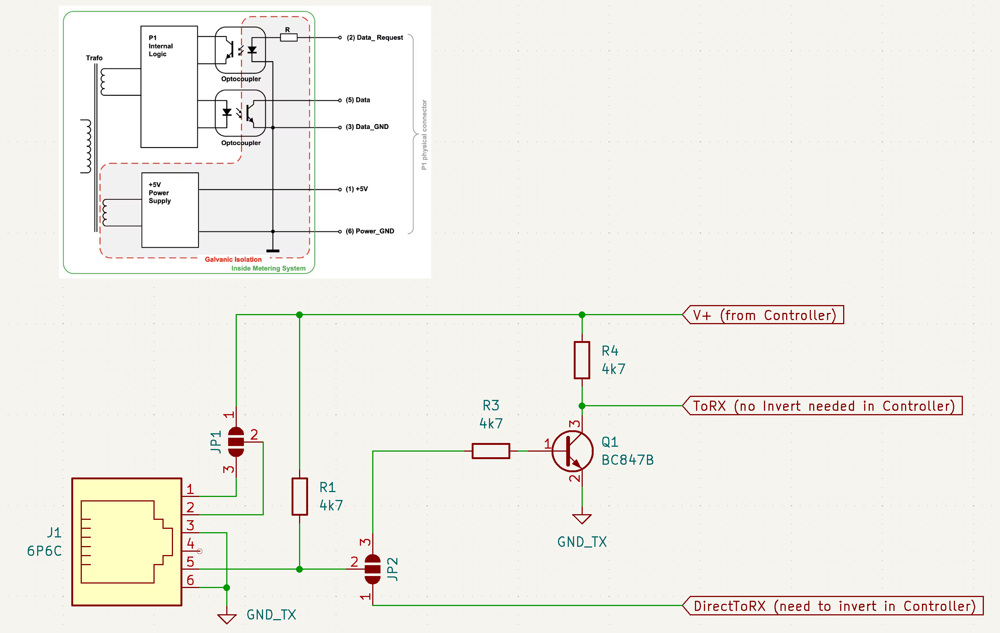

# esp32-p1meter

A p1meter-telnet implementation for:
* The platform espressif32
* Framework espidf
* example board esp32doit-devkit-v1
* Visual Studio Code - PlatformIO

The current version is transmission via Telnet only, a future version will also have MQTT messags implemented.

***

A DSMR (Dutch Smart Meter Requirements) message from a Smartmeter P1 connection is read via an UART, checked and then made available to be send via Telnet (23) for for example Home Assistant or Domoticz DSMR reader.

DSMR 5.0.2 standard
* https://www.netbeheernederland.nl/publicatie/dsmr-502-p1-companion-standard
This implementation for a esp32 idf environment, tested to be working for Home Assistant DSMR reader.
* https://www.home-assistant.io/integrations/dsmr_reader/

Testing can be done via telnet applications such as Putty (Windows) and ConnectBot (Android) by listening on port 23.

Configurations:
* Wifi_Config.h => This implementation does not have a WifiManager, so you need to input your WIFI credentials in this file
* Telnet_Config.h
  * TELNET_MAX_SOCKET
    * Defines the maximum telnet connections to be active at the same time (e.g. 5 means max 5 applications connected)
* SmartMeter_Config.h
  * Defining the UART RXD pin (GPIO_NUM_16)
  * Baudrate of the DSMR message (115200)
  * Defined buffer sizes

***

Development links:
* https://platformio.org/
* https://docs.platformio.org/en/latest/platforms/espressif32.html

***

Thanks to:
* https://github.com/romix123/P1-wifi-gateway
* https://github.com/bartwo/esp32_p1meter
* https://github.com/daniel-jong/esp8266_p1meter

And the insights of:
* https://github.com/espressif/esp-idf/blob/master/examples/protocols/sockets/tcp_server/main
* https://github.com/espressif/esp-idf/blob/master/examples/protocols/sockets/tcp_server/main
* https://esp32.com/viewtopic.php?t=911